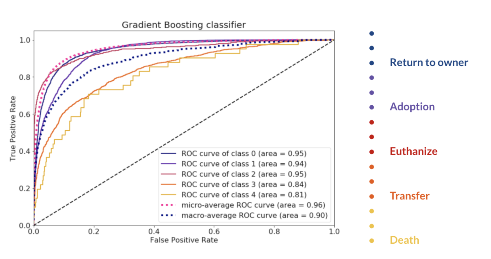
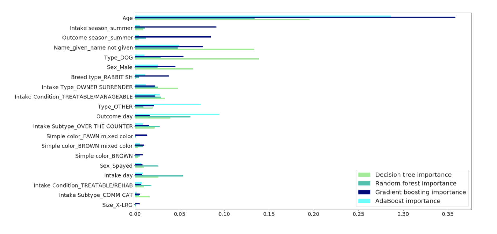

# Shelter outcomes classification

My aim with this project was to build prediction models from the raw data of an animal shelter, 
which aim to predict the trends in animal outcomes, as overpopulation in shelters is one of the main reasons behind Euthanasia.
By using the model, shelters are able to focus on those animals who need more help to get adopted.

## Project walkthrough
1. [Problem introduction + Cleaning](https://github.com/Klariss/animal_shelter_outcomes/blob/master/cleaning.ipynb)
2. [Exploratory data analysis](https://github.com/Klariss/animal_shelter_outcomes/blob/master/EDA.ipynb)
3. [Testing different algorithms](https://github.com/Klariss/animal_shelter_outcomes/blob/master/Testing_different_algorithms.ipynb)
4. [Gradient Boosting](https://github.com/Klariss/animal_shelter_outcomes/blob/master/Gradient_Boosting.ipynb)

### [Problem introduction + Cleaning](https://github.com/Klariss/animal_shelter_outcomes/blob/master/cleaning.ipynb)

Part of the cleaning I dealt with the missing values and any unnecessary features, as well as feature alterations like 
changing animal names to wether the animals have name or not.

### [Exploratory data analysis](https://github.com/Klariss/animal_shelter_outcomes/blob/master/EDA.ipynb)
For the EDA, I explored the most important variables and examined their possible relation to the prediction process. 

### [Testing different algorithms](https://github.com/Klariss/animal_shelter_outcomes/blob/master/Testing_different_algorithms.ipynb)
I started out with the baseline accuracy of 44%.

I tried out several algorithms to find the one that predicts best the outcomes, I mostly focused on the ensemble methods like 
Decision trees, Random Forest, AdaBoost and Gradient Boosting but I also tried Logistic regression to compare. 

### [Gradient Boosting](https://github.com/Klariss/animal_shelter_outcomes/blob/master/Gradient_Boosting.ipynb)

After evaluating the models Gradient Boosting with the help of tuning, proved to be an effective way to enhance the accuracy 
and represent an 80% accuracy score for the classification. The evaluation of the best model can be seen below.

Finally I plotted the feature importances by all the models, ordering by importances of the Gradient Boosting model. 

Presentation to this project available on the link below!
https://docs.google.com/presentation/d/1TeyJW7wYiTxVHdAI88GYWJl3VkQKelax8OmXWrF2GWA/edit#slide=id.g4e352ec16c_0_1015

